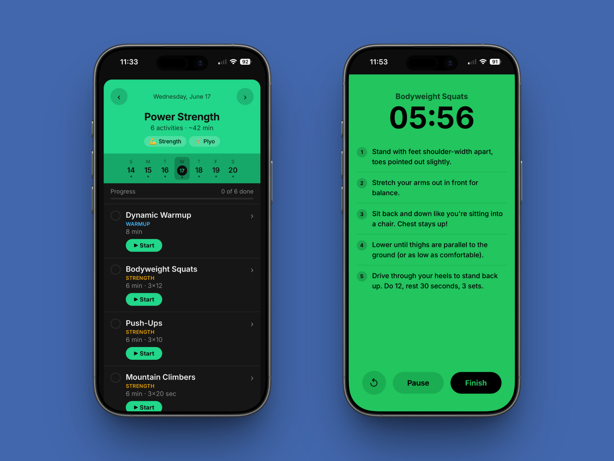

# Train Today

A lightweight, single-file training app for young multi-sport athletes. No frameworks, no build step. Just open the HTML file in a browser.

## What it does

- Shows a daily workout drawn from a rotating 10-week plan that cycles forever
- Activities cover soccer, football, track, strength, cardio, and plyometrics
- Each activity has step-by-step instructions written for young athletes
- Tap/click an activity to expand the how-to guide
- Check off activities as you complete them; a progress bar tracks the day
- Navigate forward/backward by day or tap any day in the week strip
- "Jump to Today" button appears whenever you're browsing another date

## Usage

Open `index.html` in any browser. No server needed.

Works on phone or desktop. Designed to be bookmarked on a phone home screen.

## Customizing

All workouts live in two places inside the `<script>` block:

- **`ACTIVITIES`**: the exercise library (name, duration, tag, step-by-step instructions)
- **`dayWorkouts`** inside `getWorkoutForDate`: named workout combos that pull from the library
- **`weekPatterns`**: a 10-week rotation array; each row is Mon-Sun, each value is a `dayWorkouts` key

To add a new exercise: add an entry to `ACTIVITIES`, then reference it in an existing or new `dayWorkouts` entry.

## Sports covered

⚽ Soccer · 🏈 Football · 🏃 Track · 💪 Strength · 🏃 Cardio · 🤸 Plyometrics
