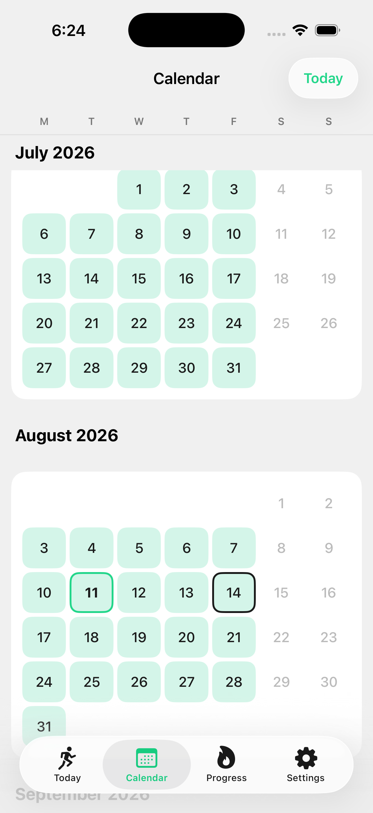
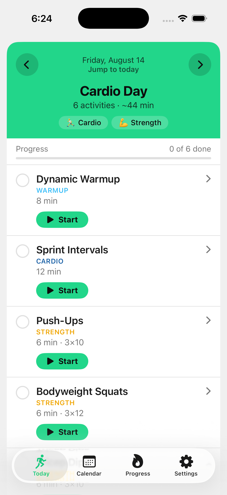
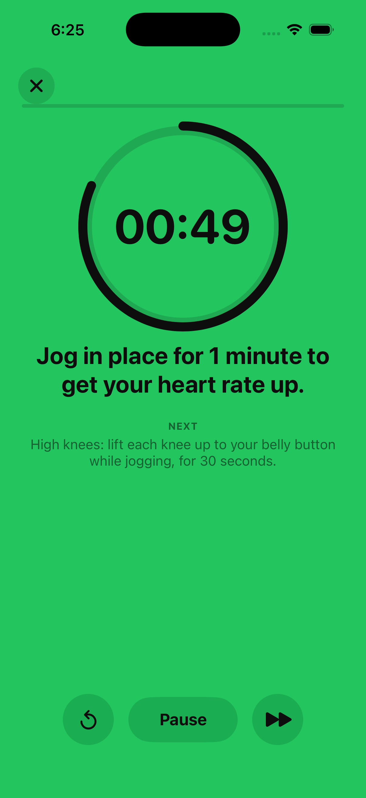

# DRILL

Multi-sport training for young athletes. A native SwiftUI iPhone app that builds a
daily training session around the sports your athlete actually plays, then talks them
through it step by step.

⚽ Soccer · 🏈 Football · 🏁 Track · 🏃 Cardio · 💪 Strength · 🤸 Plyometrics · ⚖️ Balance

<p>
  
  
  
</p>

## What it does

- **Builds the plan for you.** Pick your sports, your training days and how long a
  session should run. Every training day gets a warmup, three or four drills weighted
  to those sports, a strength or plyo finisher and a cooldown. Sports rotate rather
  than cluster, and no drill repeats two days running.
- **Talks you through it.** Each step is timed on its own and read aloud, with a cue
  and a haptic on every change — sets and rests count themselves down, so the phone can
  go in a pocket mid-drill.
- **Tracks what matters.** A forgiving streak (rest days never break it), a month
  calendar, twelve reachable badges, and personal records with their history.
- **Reminds you.** One local notification per training day, at a time you choose.
- **Keeps everything on the device.** No account, no analytics, no third-party code,
  and not a single network request.

## Repo

| Path | What |
|---|---|
| `ios/` | The Xcode project and app sources. |
| `site/` | The marketing site for trainwithdrill.com. |
| `site/app/` | The original vanilla-JS web app, still live until the App Store release. |
| `tools/` | Content validation and page generation. Plain Node, no dependencies. |
| `docs/` | The migration plan. |

## Building

Requires Xcode 16 or later. No package manager, no third-party dependencies.

```sh
cd ios
xcodebuild -project DRILL.xcodeproj -scheme DRILL \
  -destination 'platform=iOS Simulator,name=iPhone 17 Pro' build
```

Run the tests:

```sh
cd ios
xcodebuild -project DRILL.xcodeproj -scheme DRILL \
  -destination 'platform=iOS Simulator,name=iPhone 17 Pro' test
```

## The exercise library

All 33 exercises and 170 steps live in `ios/DRILL/Resources/exercises.json`, written
for an 8–12 year old to follow without a coach standing over them. Every step carries
a role (setup, form, cue or the work itself) and, where it has one, a timing — which
is what lets the app walk them one at a time instead of showing a wall of text.

```sh
node tools/validate-content.js       # schema, plus proves the step text is unchanged
node tools/build-site-exercises.js   # regenerates the public library page
```

## Safety

DRILL is a training plan, not a coach and not medical advice. Check with a parent
before starting a new plan, warm up first, drink water, and stop if something hurts.

## License

MIT. See [LICENSE](LICENSE).
